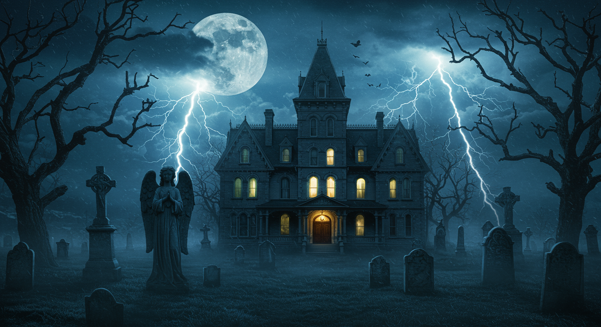

# Main-page animation composition baseline

## Owner's decision

On 2026-10-10 at 09:45, the owner reattached this image and stated:

> i gave this image earler fo the layout and density of things and elements i wanted for the main page animation it was to be a base line

This is an explicit composition baseline, not just a mood board. It sits
alongside the [preserved live house](../../snapshots/README.md): preserve that
house's identity and behavior while using this image to assess layout, density,
scale relationships, and depth. This clarification does not request an immediate
site change or select a different house revision.

Later in the same session, the owner explicitly requested the first house
rather than the live replacement. That correction changes the house target,
not this image's layout/density role. See the
[restoration brief](restoration-brief.md) for the earlier-house candidate;
the replaced live version remains protected in its historical archive.

## Visible composition to preserve in future design reviews

These are observations of the supplied image, not additional owner quotations
or approved pixel-level requirements.

| Region | Baseline relationship | Review criterion |
|---|---|---|
| Focal mansion | Prominent, near the middle and slightly right; full roof silhouette, broad facade, clearly lit entrance and windows | The building must feel substantial rather than like a small distant prop. Preserve the approved house artwork; do not copy this mansion's architecture. |
| Side framing | Large bare trees occupy both edges, with branches reaching inward and overhead | Retain substantial framing coverage on both sides without obscuring the focal house or entrance. Tiny isolated trees are not equivalent. |
| Graveyard | Numerous varied headstones across foreground and middle distance; tall crosses/monuments and a prominent angel monument on the left | Compare variety, spatial coverage, and near/far scale. A few repeated markers do not reproduce this density. Source suitable monument artwork legally before using it. |
| Depth | Large cropped foreground objects, smaller distant graves/trees, overlapping silhouettes, and atmospheric separation | Build distinct foreground, midground, house, and distant layers; do not distribute same-sized objects uniformly. |
| Ground | Textured dark terrain and low fog connect the graveyard and mansion | Ground objects should feel rooted in one landscape; fog must add depth rather than hide mismatched assets. |
| Sky | Large moon upper-left, layered clouds, rain, small bats above/around the roof, and branching lightning to either side | Keep the sky populated and balanced, with enough visible space for weather. Mere presence of one small effect is not the same composition. |
| Light and palette | Cool blue/teal surroundings contrast with warm yellow/amber windows and doorway | Use consistent scene lighting and a readable focal point; this does not independently authorize changing the live house's palette. |
| Overall density | Richly populated perimeter, graveyard, and sky with a legible central focal building | Match occupied regions and hierarchy, not just a checklist of objects. Dense does not mean random clutter or covering the house. |

The reference is a still, so it does not prescribe movement speed, lightning
frequency, camera motion, entrance timing, exact bat/grave counts, or mobile
cropping. Retain existing controls, reduced-motion behavior, and one-time
arrival unless those are explicitly changed.

## Compare before approval

1. Open this saved image and a candidate still at comparable framing. Also
   compare the candidate against the protected live-house snapshot.
2. Check the mansion's prominence, tree framing, graveyard variety/coverage,
   monument hierarchy, sky occupancy, fog, and foreground-to-distance layering.
3. Document purposeful departures for UI readability, the approved house,
   entrance gates/path, mobile framing, or accessibility. The reference has no
   homepage UI or entrance gateway; it does not request removing existing ones.
4. Review the candidate's entrance and settled state separately. Do not infer
   new animation requirements from this static image.
5. Record the owner's feedback and approval before replacing anything live.

## Provenance and handling

- Received again: 2026-10-10, via the owner's chat attachment.
- Saved file: [layout-density-reference.png](layout-density-reference.png).
- Original attachment filename: `zrjg0us5jdcprdhc12b6uxxj.png`.
- The attachment itself is read-only; the library stores an unchanged copy.
- Original creator/source/license/AI status: not supplied or verified.
- Use: internal layout/density reference only; not approved runtime artwork.
- This folder is outside the static site's publishing allowlist.
- File identity and dimensions are recorded in [reference metadata](reference-metadata.json).

Do not crop/extract this image into site assets, hotlink it, or offer it as a
downloadable creative element without establishing applicable rights.
